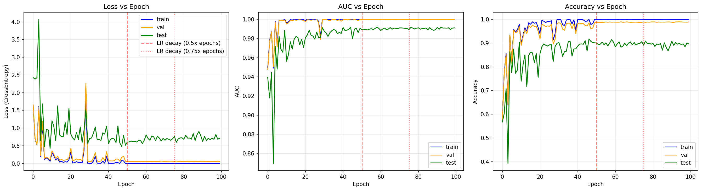
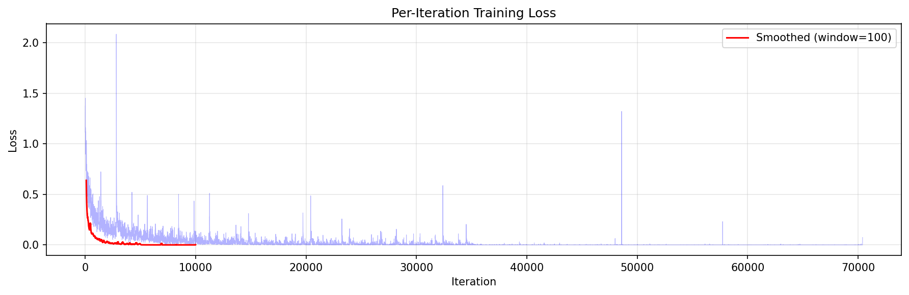
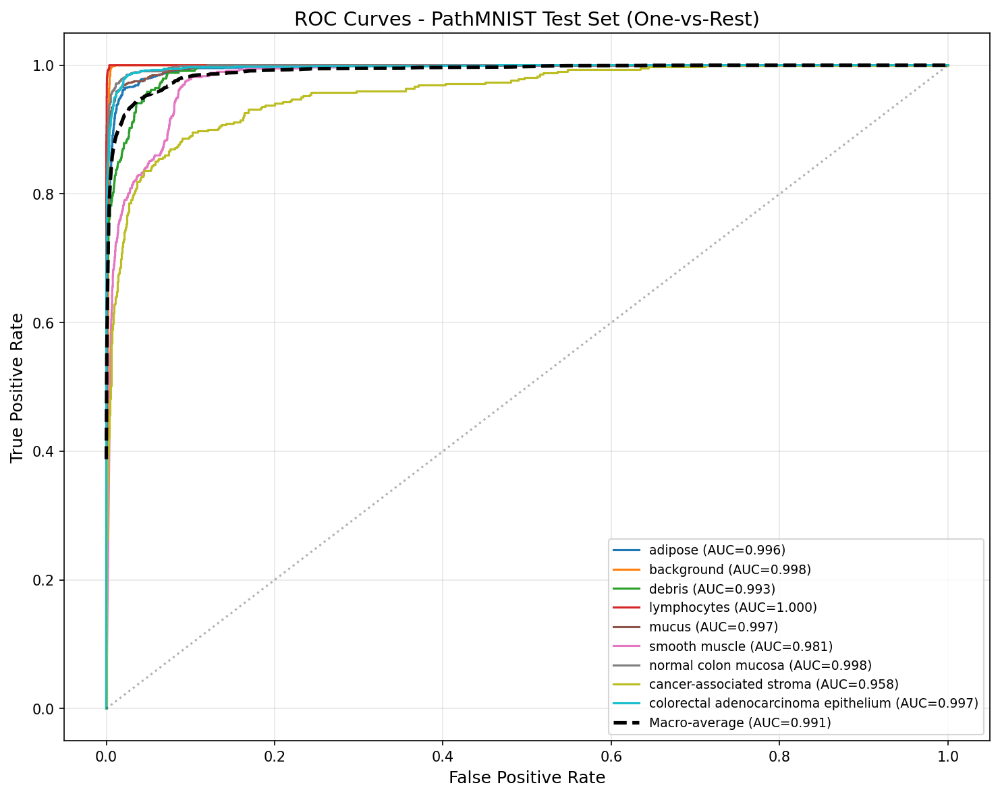
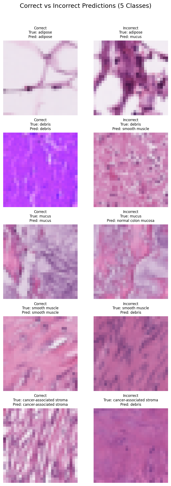

# BIOE245 Homework: Pathology Image Classification

Izabella Zamora

## Task 1: Run Training

I set up the environment and ran the training script on a SLURM GPU node (H100). Used the default settings — ResNet-18 on PathMNIST, 100 epochs, batch size 128, Adam optimizer with lr=0.001. The dataset downloaded automatically through MedMNIST. Training took about 37 minutes and the best model was saved at epoch 79. Here are the final results:

- Train: AUC 1.000, ACC 1.000
- Val: AUC 0.9998, ACC 0.989
- Test: AUC 0.991, ACC 0.895

## Task 2: Training Configuration Analysis

### 1. What learning rates are used in the training?

The starting learning rate is 0.001. The script uses a `MultiStepLR` scheduler that drops the LR by 10x at two points — at epoch 50 (halfway) and epoch 75 (three-quarters through training). So the schedule looks like:

- Epochs 0–49: lr = 0.001
- Epochs 50–74: lr = 0.0001
- Epochs 75–99: lr = 0.00001

These milestones are calculated as `0.5 * num_epochs` and `0.75 * num_epochs` with `gamma=0.1`.

### 2. What is the train/val/test split of the dataset (provide sample counts)?

I checked the dataset sizes after loading:

- Train: 89,996 samples
- Val: 10,004 samples
- Test: 7,180 samples
- Total: 107,180 samples

The dataset contains RGB histology images of colorectal cancer tissue, split across 9 tissue type classes.

### 3. What are the dimensions of the model input per batch?

`[128, 3, 28, 28]` — so 128 images per batch, 3 color channels (RGB), 28x28 pixels each. The last batch of each epoch is smaller (12 samples) since 89,996 doesn't divide evenly by 128.

### 4. What is the dimension of the model output during training? What does it represent?

`[128, 9]` — for each of the 128 images in the batch, the model outputs 9 raw logits, one for each tissue type class:

0. Adipose
1. Background
2. Debris
3. Lymphocytes
4. Mucus
5. Smooth Muscle
6. Normal Colon Mucosa
7. Cancer-Associated Stroma
8. Colorectal Adenocarcinoma Epithelium

### 5. What type of task is this? What loss function is used?

It's a multi-class classification task — each image belongs to exactly one of the 9 classes. The script checks the task type from `medmnist.INFO` and picks the loss accordingly:

```python
if task == "multi-label, binary-class":
    criterion = nn.BCEWithLogitsLoss()
else:
    criterion = nn.CrossEntropyLoss()
```

Since PathMNIST is `"multi-class"`, it uses `CrossEntropyLoss`.

### 6. How many files are generated after training? Where are they located and what do they contain?

6 files total, saved under `output/pathmnist/<timestamp>/`:

1. `best_model.pth` — saved model weights (the best model by val AUC)
2. `pathmnist_log.txt` — a short text file with the final AUC and accuracy for train/val/test
3. `Tensorboard_Results/events.out.tfevents.*` — TensorBoard log with all the training curves (loss, AUC, accuracy per epoch, plus per-iteration loss)
4. `pathmnist_train_[AUC]1.000_[ACC]1.000@model1.csv` — prediction scores for every training sample
5. `pathmnist_val_[AUC]1.000_[ACC]0.989@model1.csv` — same for validation
6. `pathmnist_test_[AUC]0.991_[ACC]0.895@model1.csv` — same for test

The CSVs are generated by the `medmnist.Evaluator` and contain the predicted probabilities for each sample.

## Task 3: Training Statistics Visualization

### 1. Where are the training statistics stored? Demonstrate how to visualize them.

They're stored as TensorBoard event files in `output/pathmnist/<timestamp>/Tensorboard_Results/`.

You can view them interactively with:
```bash
tensorboard --logdir output/pathmnist/<timestamp>/Tensorboard_Results
```

I also wrote a script (`analyze_results.py`) that loads the events using `EventAccumulator` and plots them with matplotlib, which is how I generated the figures below.

### 2. How many curves are displayed? What do they represent and how are they calculated?

There are 10 logged scalars total:

- 9 per-epoch curves: loss, AUC, and accuracy for each of train/val/test
- 1 per-iteration curve: the batch-level training loss (`train_loss_logs`)

Loss is the average CrossEntropyLoss over the epoch. AUC and accuracy come from `medmnist.Evaluator.evaluate()`, which computes AUC using a one-vs-rest approach and accuracy as the standard top-1 metric.

### 3. How does the learning rate schedule correlate with the behavior of the curves?

You can clearly see the effect of the LR drops in the plots (I marked them with red dashed lines at epochs 50 and 75):

- At epoch 50, when LR drops from 0.001 to 0.0001, there's a noticeable drop in loss and a bump up in AUC/accuracy. With a smaller step size the optimizer can settle into a better spot.
- At epoch 75 (LR goes to 0.00001) there's another smaller improvement. The model fine-tunes a bit more.
- Between the LR drops, the curves mostly plateau — the model has roughly converged for that learning rate.

### 4. What observations can you make about the curve trends? Are they monotonically increasing, decreasing, or fluctuating? Explain why.

Loss generally decreases and AUC/accuracy generally increase, but none of them are strictly monotonic — there are fluctuations throughout, especially in the val and test curves early on. This makes sense because the model is changing every batch but val/test are evaluated on the same fixed data, so small weight changes can cause the metrics to jump around.

Train loss is consistently lower than val/test, and train AUC/accuracy are higher, which indicates some overfitting. The gap isn't huge though — the model generalizes reasonably well.

After each LR drop the curves smooth out noticeably since the model takes smaller steps.





## Task 4: AUC Metric Analysis

### 1. Is AUC used in this training script? If so, is it applied directly for binary classification, or are there adaptations for multi-class classification?

Yes — AUC is actually the main metric used for model selection. The script saves whichever model has the highest validation AUC during training.

Since this is a 9-class problem (not binary), the AUC can't be applied directly. The MedMNIST evaluator handles this with a one-vs-rest approach: for each class, it treats it as a binary problem (this class vs. everything else), computes `roc_auc_score` for that class, then averages across all 9 classes (macro-average). After training, the softmax outputs give the predicted probability for each class, which are used as the scores for the ROC computation.

### 2. What curve does "AUC" refer to? Plot this curve for the saved model evaluated on the test set.

AUC stands for Area Under the ROC (Receiver Operating Characteristic) Curve. The ROC curve plots True Positive Rate vs. False Positive Rate at different classification thresholds. An AUC of 1.0 means perfect separation, 0.5 is random guessing.

Here are the per-class ROC curves on the test set. Most classes have AUC > 0.99, with cancer-associated stroma being the hardest to classify (AUC = 0.958):



### 3. Correct and incorrect prediction examples

I picked 5 classes and found one image the model got right and one it got wrong for each. The chosen classes are adipose, debris, mucus, smooth muscle, and cancer-associated stroma.



Looking at the misclassifications, they make intuitive sense — some of the tissue types look pretty similar at 28x28 resolution. For example, the model confused an adipose sample for mucus, and a smooth muscle sample for debris. Cancer-associated stroma had the most errors overall, probably because stromal tissue can look similar to several other tissue types.

## Task 5: Bonus Challenge — DermaMNIST

To run on DermaMNIST instead of PathMNIST, I just changed the `--data_flag`:

```bash
python ./train_and_eval.py \
    --data_flag dermamnist \
    --download \
    --output_root ${OUTPUT_ROOT} \
    --gpu_ids 0 \
    --dataset_root ${DATASET_ROOT_DERMA}
```

No other code changes needed — the script pulls the class count, channel info, and task type from `medmnist.INFO` automatically. DermaMNIST has 7 classes of skin lesions (things like melanoma, basal cell carcinoma, melanocytic nevi, etc.) and is also multi-class, so it still uses CrossEntropyLoss.

Results:

- Train: AUC 0.945, ACC 0.781
- Val: AUC 0.924, ACC 0.753
- Test: AUC 0.914, ACC 0.733

Performance is noticeably lower than PathMNIST (test AUC 0.914 vs 0.991). I think this is because the dermoscopy images have more subtle differences between classes, and there's also a big class imbalance — melanocytic nevi make up a large chunk of the dataset while some classes have very few samples.
